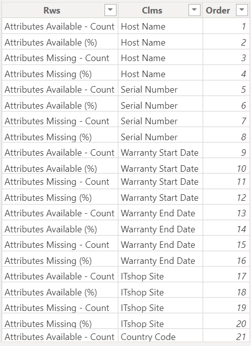

# PowerBI

Category - Email / html / URL encoding /DAX 
1. To open an email client with a prebuilt message from a Power BI web report, you can use a DAX measure to create a "mailto" hyperlink. Here's an example of how you might set up the measure:

```plaintext
Mailto = "mailto:" & [Email] & 
"?subject=" & "Your Subject Here" & 
"&body=" & "Your prebuilt message here"
```

Replace `[Email]` with the email address field from your dataset, and customize the subject and body text as needed. Once set up, clicking the textbox in your Power BI web report will trigger the opening of the default mail client with the prebuilt message.

Example

```plaintext
mailto:xyz@abc.com?cc=abcd@kjl.com
&subject=MESSAGE_1%20%
&body=%20BODY_CONTENT_LINE1%20%0D%0A%
%20BODY_CONTENT_LINE2%200D%0A
```

The code is a URL-encoded string.
%20 represents a space.
%3A represents a colon (:).

%0D represents a carriage return (CR).
%0A represents a line feed (LF).

The combination of above both will start content with new line


#

Category - DAX / Matrix_Visual 
2. Matrix having values built on DAX measure that corresponds to the Row and Column



```plaintext
KPI_Track = 
SWITCH(
    TRUE(),
    SELECTEDVALUE(Track[Order])=1,
    FORMAT([1a.Host_Name_Available],"#"
    ),
    SELECTEDVALUE(Track[Order])=2,
    FORMAT(DIVIDE([1a.Host_Name_Available],[Toatl_Count]),"00.00%"
    ),
    SELECTEDVALUE(Track[Order])=3,
    FORMAT([1b.Host_Name_Missing],"#"
    ),
    SELECTEDVALUE(Track[Order])=4,
    FORMAT(DIVIDE([1b.Host_Name_Missing],[Toatl_Count]),"00.00%")
    )
```
Create a measure and map it accordingly to the order that is created in the table (refer image)

Youtube Video Link - https://www.youtube.com/watch?v=3VYiffIgn-E

